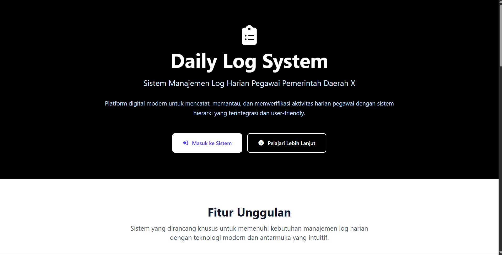
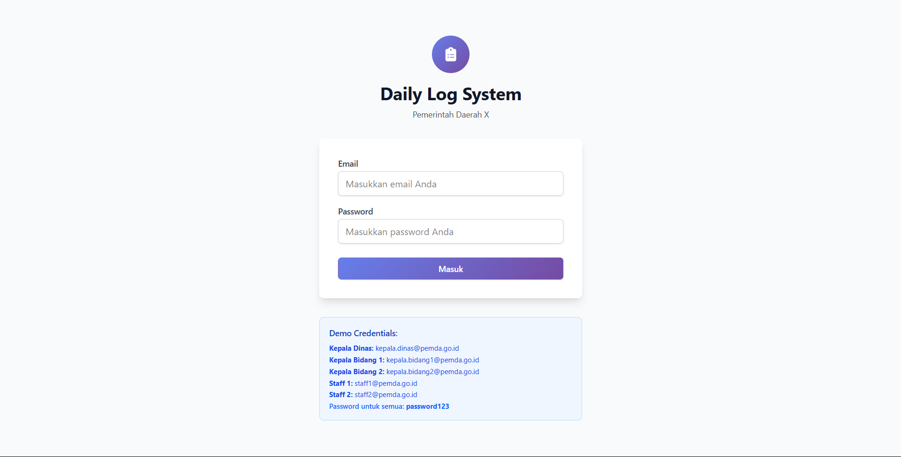
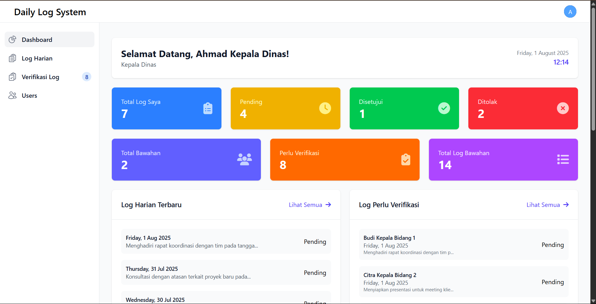
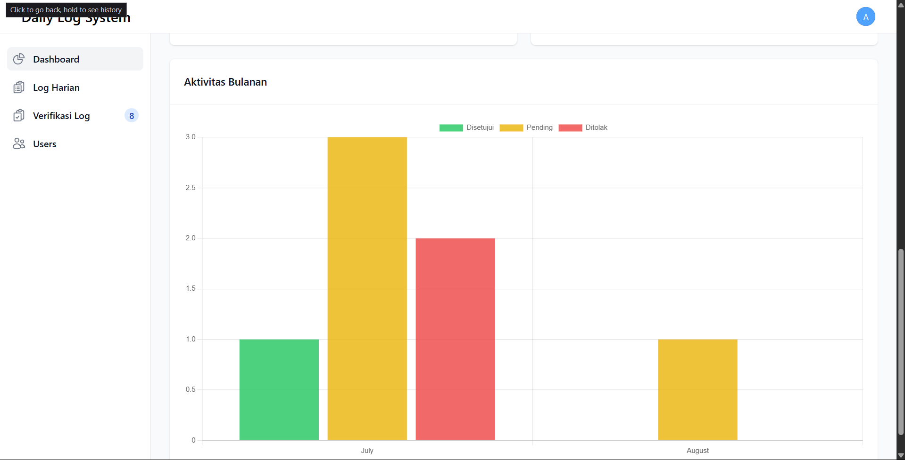
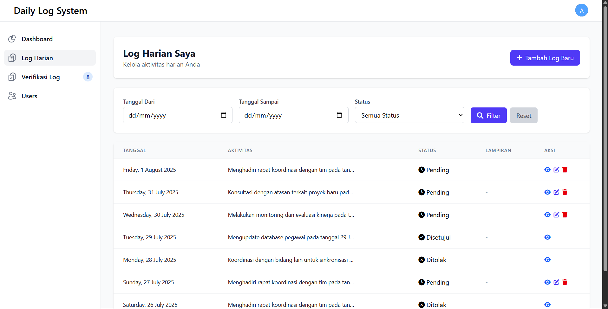
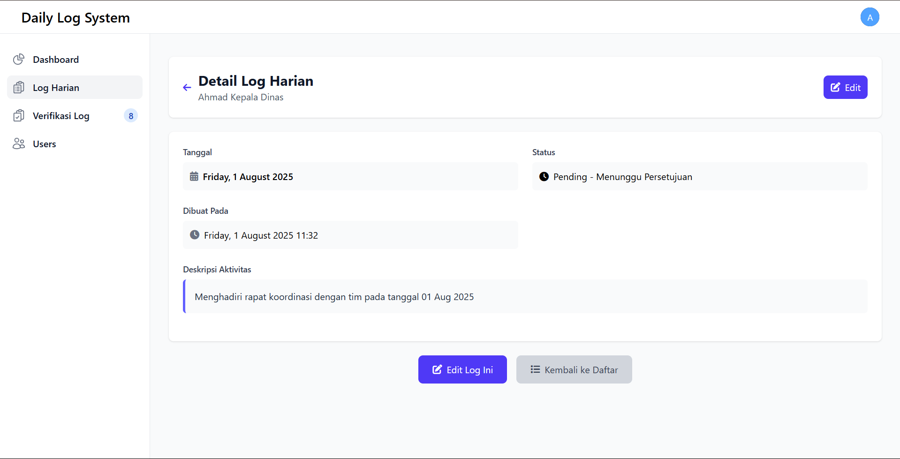
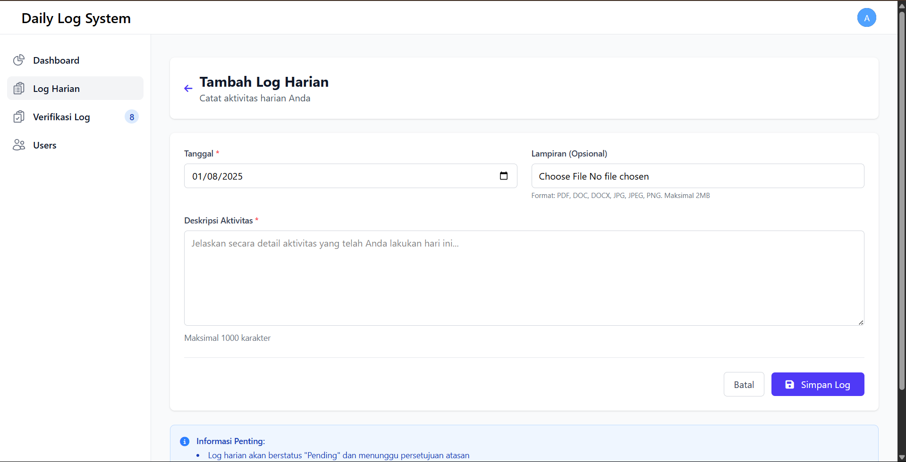
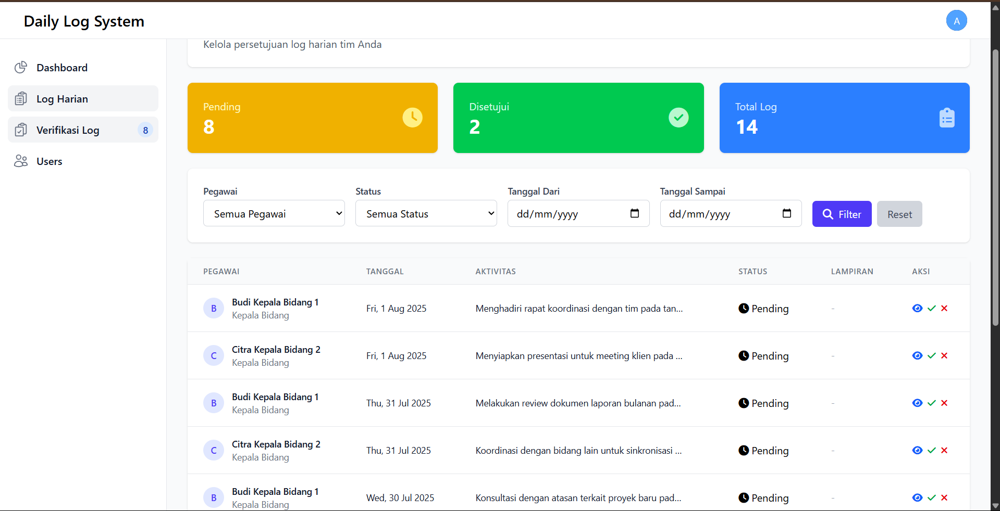
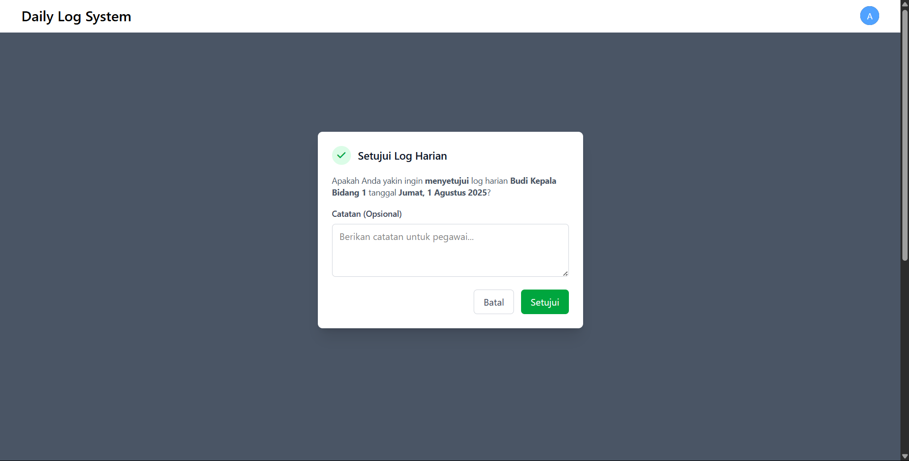

# SOAL 1

# Daily Log System - Pemda X

Sistem manajemen log harian pegawai untuk Pemerintah Daerah dengan struktur hierarki kepegawaian.

## Fitur Utama

### 1. **Manajemen Log Harian**

-   CRUD log harian dengan status (Pending, Disetujui, Ditolak)
-   Upload attachment (PDF, DOC, DOCX, gambar)
-   Filter dan pencarian berdasarkan tanggal dan status
-   Validasi form dan file upload

### 2. **Sistem Hierarki**

-   Struktur kepegawaian: Kepala Dinas → Kepala Bidang → Staff
-   Sistem supervisor-subordinate
-   Verifikasi log oleh atasan langsung

### 3. **Dashboard & Analytics**

-   Dashboard interaktif dengan statistik
-   Chart aktivitas bulanan (Chart.js)
-   Notifikasi log pending untuk supervisor
-   Quick actions dan overview

### 4. **User Experience**

-   Responsive design dengan Tailwind CSS
-   UI modern dan intuitif
-   Font Awesome icons
-   Alert dan feedback system

## Demo Credentials

| Role            | Email                      | Password    | Akses                                |
| --------------- | -------------------------- | ----------- | ------------------------------------ |
| Kepala Dinas    | kepala.dinas@pemda.go.id   | password123 | Full access, dapat melihat semua log |
| Kepala Bidang 1 | kepala.bidang1@pemda.go.id | password123 | Verifikasi log staff bidang 1        |
| Kepala Bidang 2 | kepala.bidang2@pemda.go.id | password123 | Verifikasi log staff bidang 2        |
| Staff 1         | staff1@pemda.go.id         | password123 | Input log harian                     |
| Staff 2         | staff2@pemda.go.id         | password123 | Input log harian                     |

## Struktur Hierarki

```
Kepala Dinas (Ahmad)
├── Kepala Bidang 1 (Budi)
│   └── Staff 1 (Dani)
└── Kepala Bidang 2 (Citra)
    └── Staff 2 (Eka)
```

## Instalasi & Setup

### 1. Clone dan Install Dependencies

```bash
git clone <repository>
cd Soal-1
composer install
npm install
```

### 2. Environment Setup

```bash
cp .env.example .env
php artisan key:generate
```

### 3. Database Setup

```bash
# Konfigurasi database di .env
php artisan migrate:fresh --seed
php artisan storage:link
```

### 4. Run Application

```bash
# Development
php artisan serve
npm run dev

# Production
npm run build
```

## Fitur Tambahan & Inovasi

### 1. **Enhanced Security**

-   Middleware authentication
-   Authorization checks untuk setiap action
-   File upload validation dengan type dan size limits

### 2. **Modern UI/UX**

-   Responsive design untuk semua device
-   Loading states dan feedback
-   Modal confirmations untuk actions

### 3. **Data Management**

-   Pagination untuk performance
-   Optimized queries dengan Eloquent relationships

### 4. **File Management**

-   Secure file storage dengan Laravel Storage
-   Preview untuk different file types
-   Download functionality

## API Endpoints

| Method | Endpoint                  | Description               |
| ------ | ------------------------- | ------------------------- |
| GET    | `/home`                   | Halaman Landing page      |
| GET    | `/dashboard`              | Dashboard utama           |
| GET    | `/daily-log`              | List log harian user      |
| POST   | `/daily-log`              | Create log baru           |
| GET    | `/daily-log/{id}`         | Detail log                |
| PUT    | `/daily-log/{id}`         | Update log                |
| DELETE | `/daily-log/{id}`         | Delete log                |
| GET    | `/daily-log-verification` | List log untuk verifikasi |
| PATCH  | `/daily-log/{id}/verify`  | Approve/reject log        |

## Technology Stack

-   **Backend**: Laravel 11, PHP 8.2+
-   **Frontend**: Blade Templates, Tailwind CSS
-   **Database**: MySQL
-   **Charts**: Chart.js
-   **File Storage**: Laravel Storage

## Workflow Log Harian

1. **Input Log** (Staff)

    - Pilih tanggal
    - Isi deskripsi aktivitas
    - Upload attachment (opsional)
    - Status: Pending

2. **Verifikasi** (Supervisor)

    - Review log bawahan
    - Approve atau Reject
    - Tambah catatan (opsional)

3. **Tracking** (All Users)
    - Dashboard overview
    - Filter dan search

## Database Schema

### Users Table

-   id, name, email, password
-   role (kepala_dinas, kepala_bidang, staff)
-   supervisor_id (self-reference)

### Daily Logs Table

-   id, user_id, log_date
-   activity_description, status, attachment
-   timestamps

### UI

#### Halaman Utama



#### Halaman Login



#### Halaman Dashboard




#### Halaman Log Harian





#### Halaman Verifikasi Log (oleh atasan)



