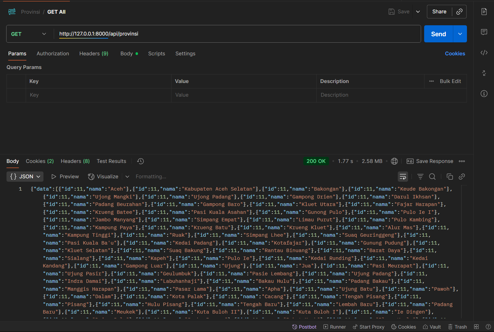
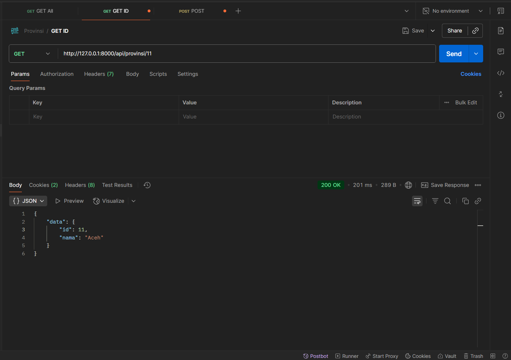
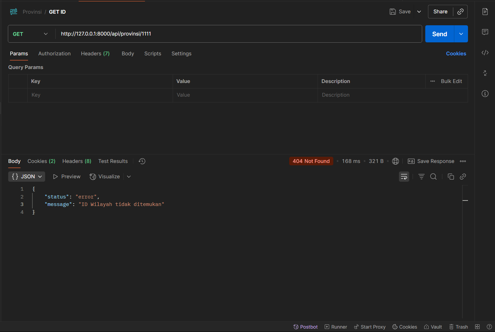
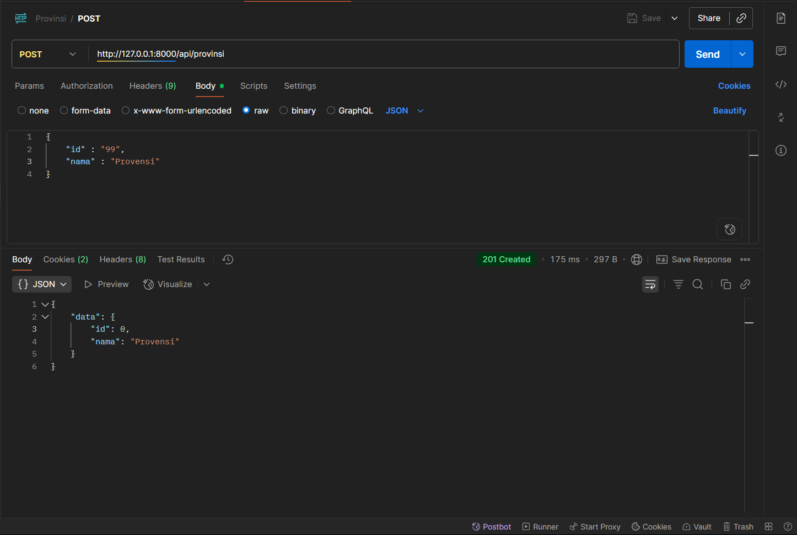
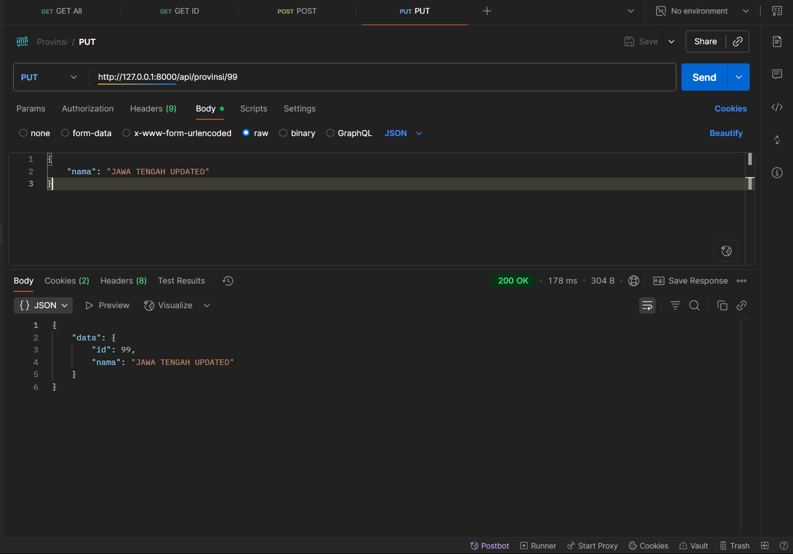
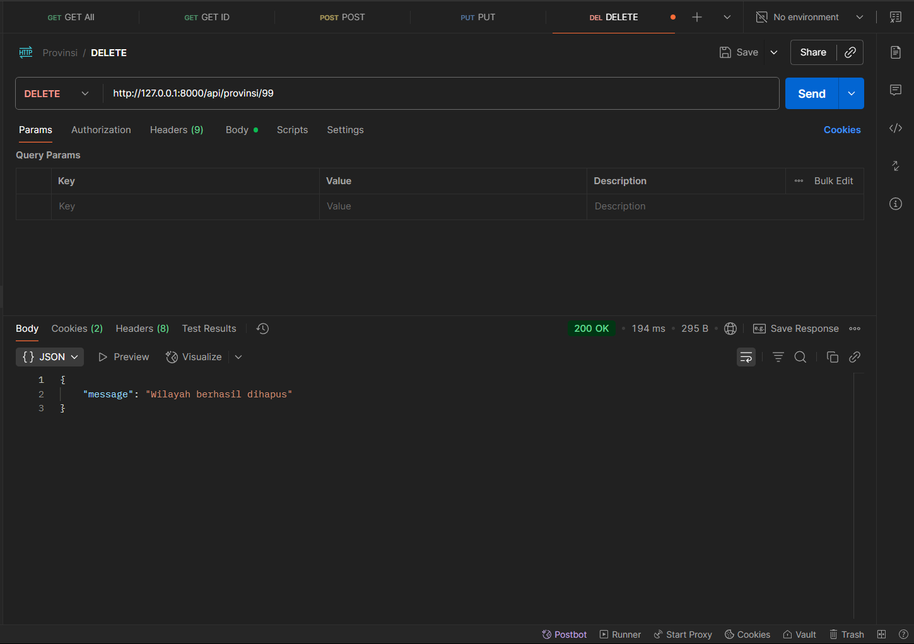

# SOAL 2

# API Wilayah - Laravel Application

Aplikasi REST API untuk mengelola data wilayah/provinsi menggunakan Laravel Framework.

## Deskripsi

API ini menyediakan endpoint untuk melakukan operasi CRUD (Create, Read, Update, Delete) pada data wilayah/provinsi. Aplikasi ini dibangun menggunakan Laravel dengan arsitektur yang mengikuti best practices Laravel.

## Fitur

-   Menampilkan semua data wilayah
-   Menampilkan detail wilayah berdasarkan ID
-   Menambah data wilayah baru
-   Mengupdate data wilayah
-   Menghapus data wilayah
-   API Resource untuk format response yang konsisten
-   Error handling yang comprehensive

## Requirements

-   PHP >= 8.1
-   Composer
-   Laravel >= 11.0
-   Database (MySQL/PostgreSQL/SQLite)

## Instalasi

1. Clone repository ini

```bash
git clone <repository-url>
cd Soal-2
```

2. Install dependencies

```bash
composer install
```

3. Copy environment file

```bash
cp .env.example .env
```

4. Generate application key

```bash
php artisan key:generate
```

5. Konfigurasi database di file `.env`

```env
DB_CONNECTION=mysql
DB_HOST=127.0.0.1
DB_PORT=3306
DB_DATABASE=nama_database
DB_USERNAME=username
DB_PASSWORD=password
```

6. Import SQL yang tersedia di folder database

```bash
wilayah.sql
```

7. Jalankan aplikasi

```bash
php artisan serve
```

## Struktur Database

### Tabel `wilayah`

| Kolom | Tipe    | Deskripsi             |
| ----- | ------- | --------------------- |
| id    | varchar | Primary key           |
| nama  | string  | Nama wilayah/provinsi |

_Note: Tabel ini tidak menggunakan timestamps (created_at, updated_at)_

### Endpoint

| endpoint                          | method    |
| --------------------------------- | --------- |
| `127.0.0.1:8000/api/provisi`      | GET all   |
| `127.0.0.1:8000/api/provisi/{id}` | GET by ID |
| `127.0.0.1:8000/api/provisi`      | POST      |
| `127.0.0.1:8000/api/provisi/{id}` | PUT       |
| `127.0.0.1:8000/api/provisi/{id}` | DELETE    |

## API Documentation

Base URL: `http://localhost:8000/api`

### Endpoints

#### 1. GET /provinsi

Mendapatkan semua data wilayah

**Response Success (200):**

```json
{
    "data": [
        {
            "id": "11",
            "nama": "ACEH"
        },
        {
            "id": "12",
            "nama": "SUMATERA UTARA"
        }
    ]
}
```

**Response Error (500):**

```json
{
    "status": "error",
    "message": "Gagal mengambil data wilayah"
}
```



#### 2. GET /provinsi/{id}

Mendapatkan detail wilayah berdasarkan ID

**Parameters:**

-   `id` (required) - ID wilayah

**Response Success (200):**

```json
{
    "data": {
        "id": "11",
        "nama": "ACEH"
    }
}
```

**Response Error (404):**

```json
{
    "status": "error",
    "message": "ID Wilayah tidak ditemukan"
}
```




#### 3. POST /provinsi

Membuat data wilayah baru

**Request Body:**

```json
{
    "id": "33",
    "nama": "JAWA TENGAH"
}
```

**Validation Rules:**

-   `id`: required
-   `nama`: required, string, min:3, max:255

**Response Success (201):**

```json
{
    "data": {
        "id": "33",
        "nama": "JAWA TENGAH"
    }
}
```

**Response Error (400) - ID sudah ada:**

```json
{
    "message": "ID sudah digunakan"
}
```

**Response Error (422) - Validation Error:**

```json
{
    "message": "The given data was invalid.",
    "errors": {
        "nama": ["The nama field is required."]
    }
}
```

**Response Error (500):**

```json
{
    "message": "Gagal membuat Wilayah"
}
```



#### 4. PUT/PATCH /provinsi/{id}

Mengupdate data wilayah

**Parameters:**

-   `id` (required) - ID wilayah yang akan diupdate

**Request Body:**

```json
{
    "nama": "JAWA TENGAH UPDATED"
}
```

**Response Success (200):**

```json
{
    "data": {
        "id": "33",
        "nama": "JAWA TENGAH UPDATED"
    }
}
```

**Response Error (500):**

```json
{
    "message": "Gagal memperbarui Wilayah"
}
```



#### 5. DELETE /provinsi/{id}

Menghapus data wilayah

**Parameters:**

-   `id` (required) - ID wilayah yang akan dihapus

**Response Success (200):**

```json
{
    "message": "Wilayah berhasil dihapus"
}
```

**Response Error (500):**

```json
{
    "message": "Gagal menghapus Wilayah"
}
```



## Struktur Proyek

```
app/
├── Http/
│   ├── Controllers/
│   │   └── WilayahController.php    # Controller untuk API wilayah
│   └── Resources/
│       └── WilayahResource.php      # Resource untuk format response
├── Models/
│   └── Wilayah.php                  # Model Eloquent untuk wilayah
routes/
└── api.php                          # Route API definitions
```
