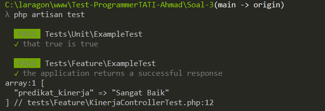

# SOAL 3

Buatlah fungsi `predikat_kinerja($hasil_kerja, $perilaku)`, yang akan menampilkan output sesuai
matriks dibawah ini.

Contoh :
`$hasil_kerja = ‘diatas ekspektasi’`
`$perilaku = ‘diatas ekspektasi’`

Output predikat kinerja Sangat Baik

## Answer

Membuat fungsi menggunakan framework laravel dan dengan menggunakan unit test untuk melihat apakah fungsi, berfungsi dengan baik atau tidak sesuai dengan soal yang sudah di berikan.

`KinerjaController.php`

```bash
 public function predikat_kinerja(Request $request)
    {
        $validated = $request->validate([
            'hasil_kerja' => 'required|string|in:dibawah ekspektasi,sesuai ekspektasi,diatas ekspektasi',
            'perilaku' => 'required|string|in:dibawah ekspektasi,sesuai ekspektasi,diatas ekspektasi',
        ]);

        $matriks = [
            'dibawah ekspektasi' => [
                'dibawah ekspektasi' => 'Sangat Kurang',
                'sesuai ekspektasi' => 'Butuh perbaikan',
                'diatas ekspektasi' => 'Butuh perbaikan',
            ],
            'sesuai ekspektasi' => [
                'dibawah ekspektasi' => 'Baik',
                'sesuai ekspektasi' => 'Baik',
                'diatas ekspektasi' => 'Baik',
            ],
            'diatas ekspektasi' => [
                'dibawah ekspektasi' => 'Sangat Kurang',
                'sesuai ekspektasi' => 'Baik',
                'diatas ekspektasi' => 'Sangat Baik',
            ],
        ];

        $predikat_kinerja = $matriks[$validated['hasil_kerja']][$validated['perilaku']];
        return response()->json(["predikat_kinerja" => $predikat_kinerja]);
    }
```

`KinerjaControllerTest.php`

```bash
<?php

use function Pest\Laravel\postJson;


test('response has correct structure', function () {
    $response = postJson('/kinerja', [
        'hasil_kerja' => 'diatas ekspektasi',
        'perilaku' => 'diatas ekspektasi',
    ]);

    dd($response->json());

    $response->assertStatus(200)
        ->assertJsonStructure([
            'predikat_kinerja',
        ]);
});
```

Output yang di hasilkan dengan mengirim response :
`$hasil_kerja = ‘diatas ekspektasi’`
`$perilaku = ‘diatas ekspektasi’`



---

# Soal 4
