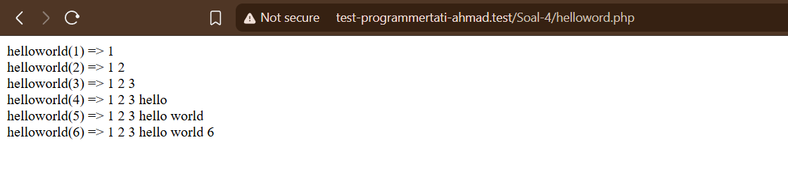

# SOAL 4

Buatlah sebuah fungsi `helloworld($n)`, yang akan menampilkan output deret bilangan 1 s/d `$n`
dengan ketentuan :

- Jika `$n` kelipatan 4, tampilkan kata hello
- Jika `$n` kelipatan 5, tampilkan kata world
- Jika `$n` kelipatan 4 dan 5, tampilkan kata helloworld

Selain itu, tampilkan `$n` contoh :

- helloworld(1) => 1
- helloworld(2) => 1 2
- helloworld(3) => 1 2 3
- helloworld(4) => 1 2 3 hello
- helloworld(5) => 1 2 3 hello world
- helloworld(6) => 1 2 3 hello world 6

## Answer

Membuat dengan menggunakan fungsi biasa pada file `helloworld.php` dengan parameter `$n` dengan output yang sesuai dengan soal yang diberikan.

```bash
<?php

function helloworld($n)
{
    if ($n < 0) {
        return "Input tidak valid";
    }

    $output = [];
    for ($i = 1; $i <= $n; $i++) {
        if ($i == 4) {
            $output[] = "hello";
        } elseif ($i == 5) {
            $output[] = "world";
        } else {
            $output[] = $i;
        }
        echo "helloworld(" . $i . ") => " . implode(" ", $output) . "<br>";
    }
}

helloworld(6);
```

output yang diberikan

